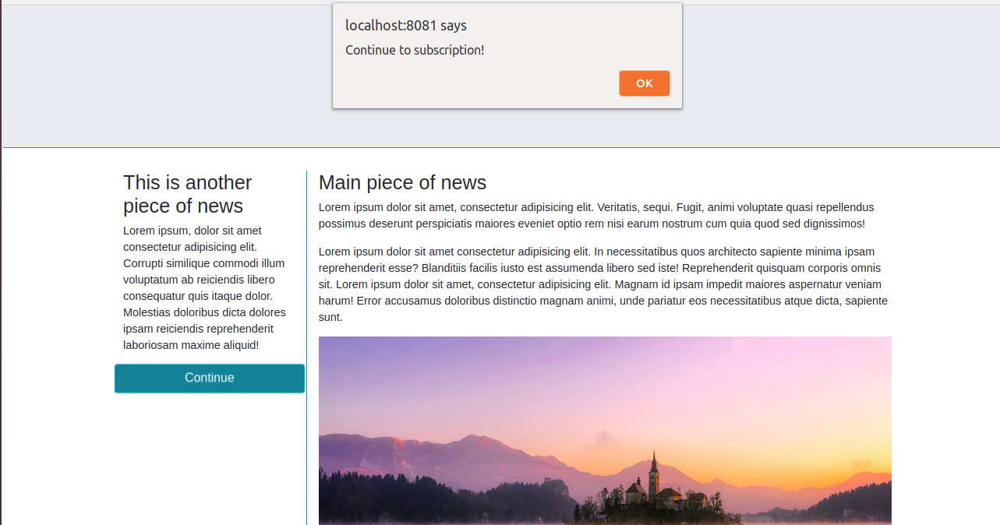

# Fetch - Async Await

**Exercise using async away syntax**:
* A promise that handles the modal popup in the `index.js` file to use `async await` syntax;
* Another promise which executes code upon the button's animation end. 
* Upon the animation end, displays an alert saying "Continue to subscribe", and change the background color of the button. 

